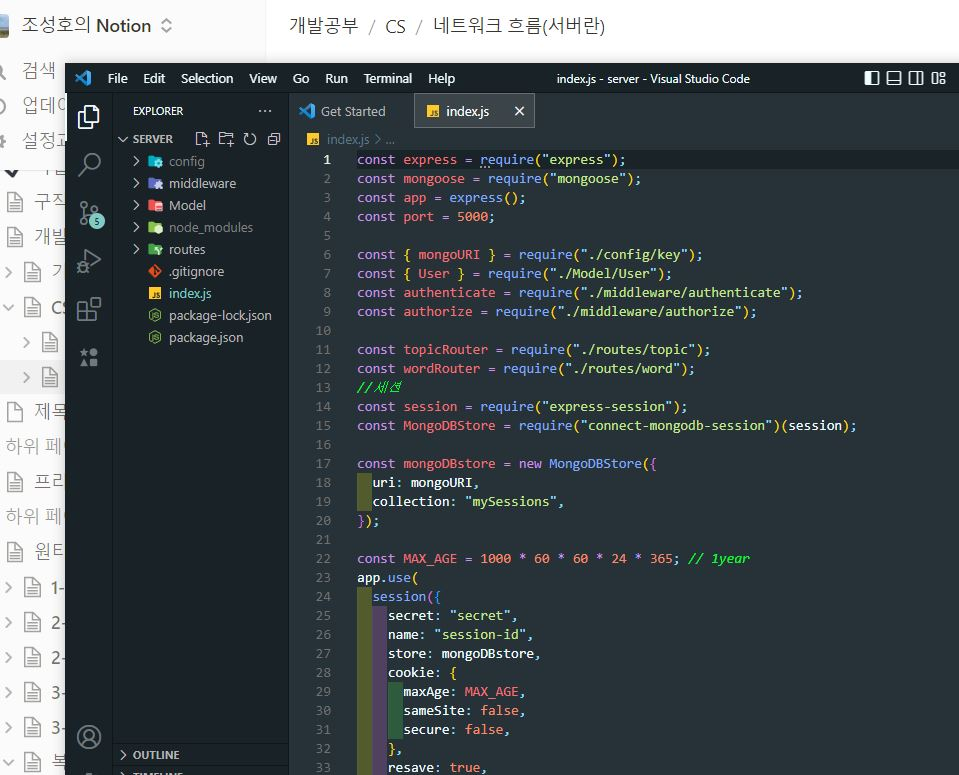
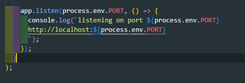
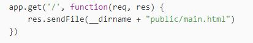

# 네트워크 기본흐름 (서버란)

## 서버란

- 서버란? 사용자의 요청에 따라 특정한 파일, 데이터 등을 제공하기 위한 일련의 코드 뭉치.
- 이미지

- 다른게 아니라 이게 서버다.
- 그럼 이게 어떻게 사용자의 요청에 반응해서 파일들을 보내주는가?

 

## 서버 컴퓨터

- 서버 컴퓨터는 위의 코드뭉치를 실행하고있는 컴퓨터이다.
- 자바스크립트로 작성되었지만 Node.js 환경을 설치해 브라우저가 아닌 컴퓨터 CPU가 자바스크립트 코드를 실행할 수 있다.
- 컴퓨터가 혹은 실행중인 서버가 종료되면 요청을 받을 수도 파일을 보낼 수도 없으니 24시간 안정적으로 가동되어야한다.

 

## 서버(코드)는 어떻게 일을 할까

### 사용자의 네트워크 요청을 기다린다.

- (어디서? => 도메인. 추후 정리작성하기)

<figure>
  
  <figcaption>요청을 기다리는 코드 `app.listen`</figcaption>
</figure>

### 요청에 맞는 파일을 보내준다.

- 파일이 어디있는데? 서버 컴퓨터의 HDD 혹은 원격 DB(몽고DB 등)에 저장되어있는 파일 혹은 데이터를 찾아서 보낸다.

 

<figure>
  
  <figcaption>get요청이 들어오면 sendFile</figcaption>
</figure>
