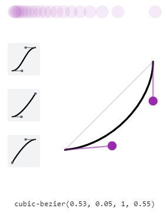

# 애니메이션

```css
/* 회전 애니메이션 */
@keyframes spin {
  /*spin은 직접 설정한 이름*/
  from {
    transform: rotate(0deg);
  }
  to {
    transform: rotate(360deg);
  }
}
/*혹은 이런 식으로 중간 경로 설정가능*/
@keyframes spin2 {
  /0% {
    transform: rotate(0deg);
  }

  50% {
    transform: rotate(180deg);
  }
  100% {
    transform: rotate(360deg);
  }
}
.spinner {
  animation-name: spin; /*사용할 애니메이션 이름*/
  animation-duration: 1s;
  animation-timing-function: linear; /*진행 속도 변화*/
  animation-timing-function: cubic-bezier(0.52, 0.02, 0.98, 0.35); /*진행 속도 변화*/
  animation-direction: alternate; /*100%에서 빠꾸*/
  animation-direction: normal; /*정의된대로*/
  animation-iteration-count: 1; /* 1번 실행*/
  animation-iteration-count: infinite; /*무한 반복*/
  /*축약식*/
  animation: spin 2s linear infinite;
}
```

## cubic-bezier



- 애니메이션 진행도를 커스텀 할 수 있다(개발자도구 이용시 편함)

- 가로축: 시간
- 세로축: 진행도
