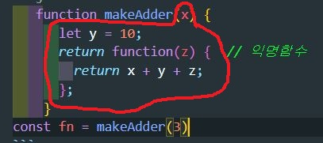

# 클로저

```js
function makeAdder(x) {
  let y = 10;
  return function (z) {
    // 익명함수
    return x + y + z;
  };
}
```

- `makeAdder`를 실행하면 익명함수를 반환한다.
- `makeAdder` 가 실행 될 때 익명함수의 입장에서 외부 변수인 `x`, `y`를 기억하게 된다.

```js
const fn = makeAdder(3);
/*
fn = (z) => 3 + 10 + z
*/

fn(2); // 3 + 10 + 2 = 15
```

- 단순히 변수 `x`, `y`를 기억하고 사용하는 것으로 보이지만 사실은 그렇지 않다.
- `fn`은 `makeAdder`가 실행 될 때 부터 고유의 lexical 환경을 보유하게 된다.
- 그리고 그러한 렉시컬 환경에 있는 변수 `x`, `y`를 통제할 수 있으며 위의 예시에서는 단순히 값을 가져온것일 뿐

## 이해를 돕기위한 예시

```js
function useFoo() {
  let foo = 0;

  function getFoo() {
    return foo;
  }

  function setFoo(value) {
    foo = value;
  }

  return [getFoo, setFoo];
}

const [getFoo, setFoo] = useFoo(); // 환경 A 생성
const [getFoo2, setFoo2] = useFoo(); // 환경 B 생성

getFoo(); // 0

setFoo(5);

getFoo(); // 5

getFoo2(); // 0
```

- `useFoo` 가 실행되었으니 `getFoo`와 `setFoo`가 공유하는 `A` 라는 고유의 렉시컬 환경이 생성되었다.
- `useFoo`를 다시 한번 실행하면 또다른 환경 `B`가 생성된다.
- `setFoo(5)`를 통해 A환경의 변수 `foo`는 5가 되었다.
- `getFoo2`와 `setFoo2`의 환경인 B에서 `foo`는 여전히 0 이다.
- 만약 `foo`가 const 로 선언되었으면 setFoo 는 작동하지않고 에러가 날 것이다.(setFoo는 `foo`값을 바꾸기 때문)

<br>

## 그래서 클로저란?

  

- 빨간색 영역은 익명함수가 같는 렉시컬환경을 시각화한것..
- fn과 같이 고유의 렉시컬 환경을 가진 함수를 `클로저`라한다.
