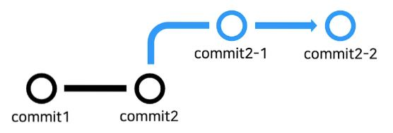
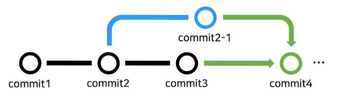
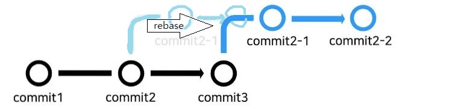

# merge

머지는 별도의 브랜치들을 병합하는 것을 말함

```
// 현재위치: 메인브랜치

git merge 서브브랜치  //메인브랜치로 서브브랜치를 머지함 (메인 <-- 서브)


//머지 후에는 기존 브랜치 삭제하는 것이 좋음

git branch -d 삭제할 브랜치 // -d는 머지 후에만 작동(안전)
git branch -D 삭제할 브랜치 // 머지 안했어도 강제삭제
```

`fast-forward merge`와 `3way merge`, `rebase and merge`, `squash and merge` 등 방법이 있음

<br>

## fast-forward merge



- 새 브랜치를 생성한뒤 메인에서 더 이상의 커밋이 없는 상황.
- 충돌이 일어나지 않고 새 브랜치의 커밋이 메인으로 그대로 반영된다.
- 팀 개발시 사실상 사용불가
- 혼자 개발할 때 안전하게 feature개발 가능할듯하다.
- 머지 내역이 별도로 커밋 되지 않는다. 표시하고 싶다면 새 커밋 하나 ㄱㄱ
- 분리 브랜치에서의 커밋 내역은 전부 가져옴

<br>

## 3-way merge



- 새 브랜치와 메인 모두 새로운 커밋이 존재 한 상태에서 merge 하는 경우
- 각 브랜치에서 같은 파일을 건드렸다면 충돌이 발생할 수 있음
- 충돌이 없다면 자동으로 머지 내역이 커밋된다.
- 충돌이 있다면 머지후 커밋을 수동으로 해야하며 그래야 합친 커밋이 반영된다.

<br>

## rebase and merge

```
// 현재위치 분리된 브랜치
git rebase 메인브랜치

git switch 메인브랜치 // 현재위치 메인 브랜치
git merge 분리된브랜치
```



- 리베이스는 브랜치 분리 후 메인에서 커밋이 일어났을 경우
  메인의 최신 커밋을 기준으로 방금 분리 한것처럼 브랜치를 이동 시키는것.
- 그 다음 fast forward 머지 하듯이 머지한다.
- 커밋 내역에 머지기록을 남기지 않음 결과적으로 fast forward를 쓰기때문
- 최신 메인커밋 상태를 반영하고 대응하고 싶으면서도 머지기록을 남기고 싶지 않을 때 3way 대신 사용하면 될 듯 하다.
- conflict 발생한다면 분리되어있던 브랜치의 각각의 커밋에 대해 충돌을 해결해야되서 번거로움
- mergetool 사용해 충돌해결 조금 더 편하게 할 수 있다.

<br>

## squash 옵션

fast-forward, 3way, rebase 에서 머지지 옵션으로 `--squash`를 줄 수있음

```
git merge --squash 분리브랜치
```

- 분리된 브랜치의 커밋내역을 메인으로 합치지 않음
- squash 머지 후 커밋하면 해당 커밋만 기록됨
- 분리 개발한 내용의 상세 커밋을 생략함으로써 메인 커밋 내역을 간결하게 유지할 수 있음
